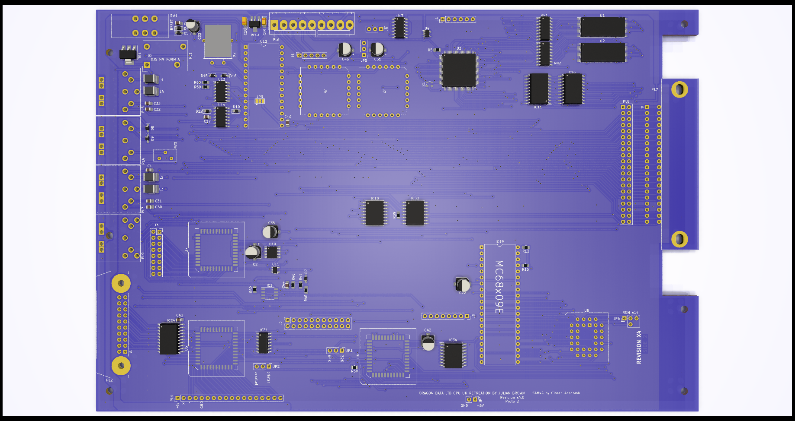

# DRAGON 32 RECREATION Rev 3 #

This project started as a recreation of the SA2120 CPU Mainboard
for the 1982 Dragon Data **Dragon 32**

Everything (excluding modifications) is taken from the SA2120
schematics. Where this version changes is the move to surface
mount components which radically alters the size of each part
along with a move to using SRAM instead of DRAM. The intention
is that the board should be supplied fully or semi-populated
leaving just optional (socketed) components to be fitted.

The ROM is now a single 28C256 eprom with an option to switch
between two images using JP6 or to allow the rom to be
automatically selected from the PIA. In effect this allows the
computer to operate as a D32 but with two different images or
as a D64.

The video circuits have been isolated from the rest of the
board to improve output quality.

To maintain compatibility with the D64 there is an optional
serial port. This needs to be enabled by bridging a solder
jumper (JP3) to position 1-2. If the serial port is not
being populated it should be position 2-3. By default this
is not bridged and the computer will not function without
the jumper being set. If the supporting SMD ICs at U13 and
U14 are fitted the jumper can safely be left in position
1-2 regardless of whether the 6551 UART chip is fitting.

If you are fitting the board into an
early D32 case the serial port would be completely covered
without modifying the case. Later D32 cases had all four
ports but the fourth (serial) port blanked off internally.

A second (internal) cartridge port has been added, by way of
a 2x20 header, along with an additional +5V/Gnd pickup point
for further internal expansion. The keyboard connector also
has two additional pins that can supply 5v to the keyboard,
the extra pins are on the left. The keyboard should always 
be fitted to the right to avoid any shorts.

The board incorporates a replacement to the SAM chip based on
Ciaran Anscomb's SAMx4 design which in turn includes Stewart
Orchards 256k banker board 
<https://gitlab.com/sorchard001/dragon-256k-banker-board>

A custom VHDL is needed for this. Do not use the code from
Ciaran's site as it won't work.

The VHDL has potential (untried as of yet) to allow the
board to run permanently at double speed without loss of
a working display. The potential extends to running at 4x
speed but this is subject to using a suitable CPU and SRAM.

Because all of the CPU speed control is managed by the CPLD
replacing the SAM it is possible to change and update the
VHDL programming to include new features provided they do
not need changes to the board itself. Running at x4 speed
would require a different oscillator at X1 but would not
need other changes. All of the specified components are 
modern high performance equivalents and should be easily
able to cope with the high clock frequencies.

The board also includes three PIAs but only the first two are
necessary for normal usage. The third PIA (U7) is used by some
of the video daughterboards to provide additional functionality
such as a programmable character "rom".

All of the PIAs are changed to the W65C21 chip instead of the
MC6821. These chips work at higher frequencies and conveniently
use a smaller PLCC package

## Progress ##

In the current state (3.0) only the basics of the board have
been tested and proven. 

To be tested:

* SRAM conversion
* Serial port
* PIA 3
* SAMx4

## Modifications ##

### Joysticks ###

The two joystick ports provide a second fire button capability
wired to consecutive keyboard rows, as per the Tandy CoCo.
Unless a two button joystick is used this make no difference to
the operation of the computer. It also requires the use of 6-pin
DIN sockets, these are pin compatible with the 5-pin originals
so a regular single button joystick can still be used.

The two extra buttons can also be disabled by omitting L3 and L4.

### Parallel Port ###

A jumper (JP2) has been introduced to bypass the logic inverter
on the STROBE line. When bypassed the parallel port should
operate as a communication port for DRIVEWIRE.

### Memory Addressing ###

The board is configurable between 32k and 64k ram addressing
using jumper JP1. In most scenarios there is no reason to
disable the 64k option.

### Video PIA ###

One of the possible features of the board is to support an
extended version of the video circuitry to include 
external character ram. Adding a third PIA to the board takes
a little refinement of how PIAs are interfaced. In this case
the mapped memory for PIA1 is broken into 8 blocks, this first
maps to the original memory space for PIA1 while the other 7 
are effectively available to more registers. On this board
only the first of those 7 is used (yet). This makes addresses
$FF44-$FF47 map to the new PIA (referenced here as 1b).

Register A of PIA1b is control of additional functions  
bit 0 controls internal or external character image generation  
bit 1 controls automatic invert on bit 6 of the data bus  
bit 2 is manual control of the invert signal  
bit 3 controls automatic semigraphics on bit 7 of the data bus  
bit 4 is manual control of the semigraphics signal  
bit 5 opens the external character ram to writing  
bit 6 is a clock trigger to the external character ram address  
bit 7 is unused (proposed to be CoCo compatibility switch for 
the keyboard)  

Register B of PIA1b is used for programming the external
character ram data.

The external character ram can only be programmed while the
video is set to the internal character data of the 6847.

### Serial Port ###

The board includes the serial port capability originally
added to the D64. This adds a dedicated 6551 UART chip
to the machine allowing serial communications at higher
speeds without locking out the CPU. The port is optional.

To allow this to work the board *must* user a D64 power
board that supplies -12V instead of -5V. It is possible
to rig the board to work by bridging two pins (2 and 3)
of REG1 but this is not the intended mode of operation.
If the board is rigged for -5V supply then REG1, C18
and C19 must be left unpopulated.

## Substitutions ##

All of the components specified with the exception of
the CPU are current and should be readily available.
Supplies of 6809 CPUs are still plentiful but are all
NOS.

The Hitachi HD6309 is usable but may cause crashes in 
some software due to lazy coding. It is however still 
made thanks to usage in old military equipment in at
least one country.

### The Future ###

The board may look empty in its current form but the design
is dominated by the main data and address busses.

The design will also include two AY8912 audio chips to 
provide stereo sound. This brings utilisation of the 
additional device addressing to 50% but also fills up
the remainder of the board.

It is possible to increase the size of the board along
the bottom edge as the current design complies with the
original D32 design rather than the enlarged D64 board.
